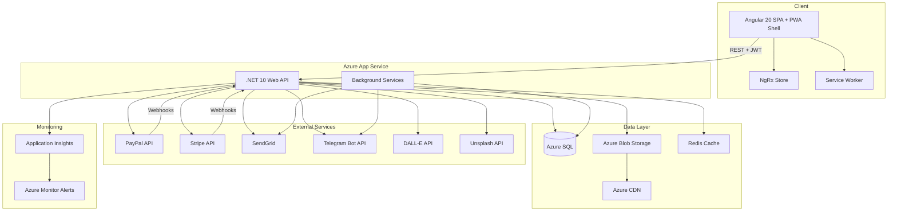
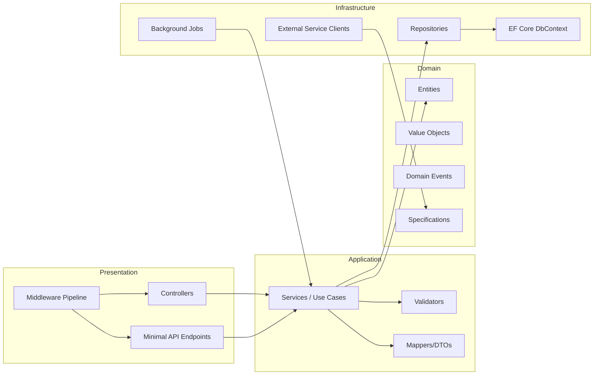
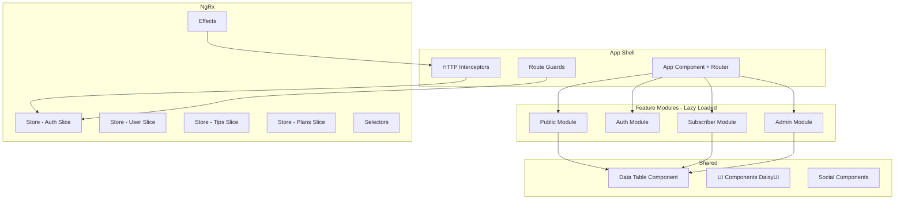
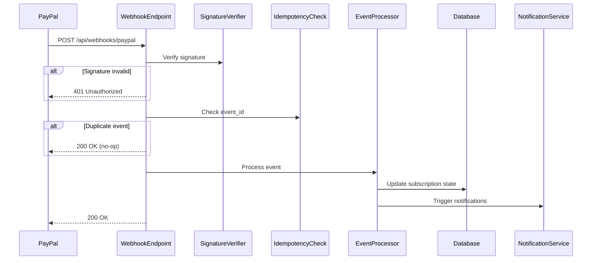
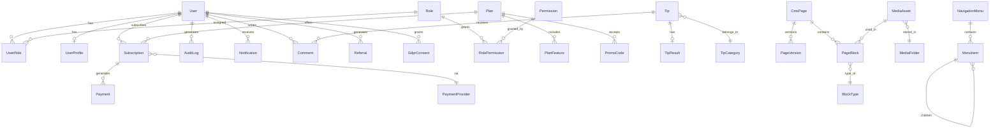
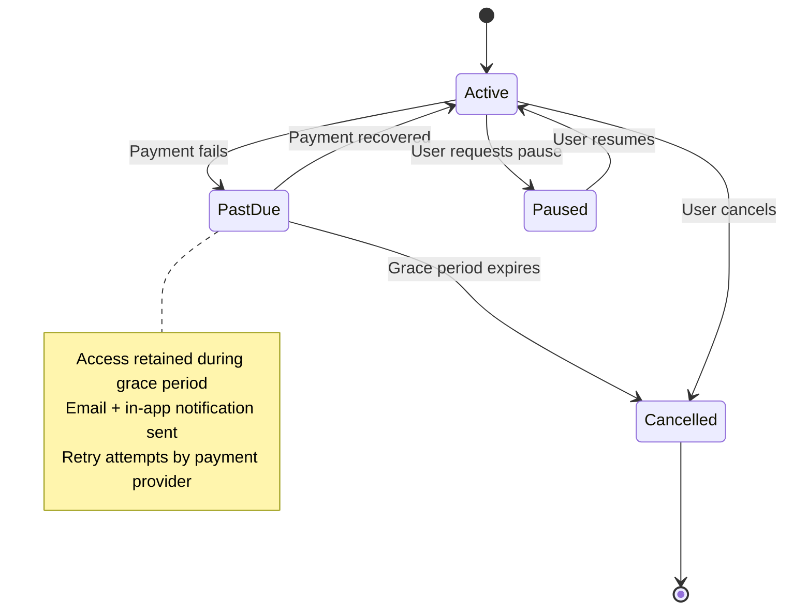

# Design Document — AndyTipster V2 Platform

## Overview

AndyTipster V2 is a complete rebuild of a horse racing tips subscription platform targeting UK/Ireland horse racing enthusiasts. The system encompasses user authentication, subscription management via PayPal and Stripe, a custom block-based CMS, a tips engine with P&L tracking, multi-channel notifications, and comprehensive admin tooling.

The architecture follows a clean separation between a .NET 10 Web API backend and an Angular 20 SPA frontend, connected via RESTful APIs with JWT authentication. State management is centralised through NgRx, payments are processed via PayPal and Stripe webhooks, content is managed through a custom page builder, and all infrastructure runs on Azure.

### Key Design Decisions

1. **Minimal APIs + Controllers hybrid** — Minimal APIs for simple CRUD endpoints (performance), Controllers for complex domain operations (organisation and filters)
2. **CQRS-lite pattern** — Read/write separation at the service layer without separate databases; enables future scaling
3. **Event-driven webhook processing** — Idempotent, queue-backed webhook handlers for PayPal/Stripe with dead-letter handling
4. **NgRx Entity for normalised state** — Avoids data duplication in the frontend store; enables efficient selector composition
5. **Block-based CMS with JSON persistence** — Page content stored as JSON block arrays; enables version diffing and rollback without complex relational modelling
6. **Multi-tenant notification pipeline** — Channel-agnostic notification core with pluggable delivery adapters (email, push, Telegram, in-app)

---

## Architecture

### High-Level System Architecture



### Backend Architecture (Layered)



### Frontend Architecture (Angular 20 + NgRx)



---

## Components and Interfaces

### Backend API Modules

| Module | Responsibility | Key Endpoints |
|--------|---------------|---------------|
| Auth Module | Registration, login, JWT, 2FA, social login, password reset | `POST /api/auth/register`, `POST /api/auth/login`, `POST /api/auth/refresh`, `POST /api/auth/2fa/*` |
| User Module | Profile management, user CRUD, role assignment, impersonation | `GET/PUT /api/users/{id}`, `POST /api/users/{id}/impersonate`, `GET /api/users/export` |
| Roles Module | Role CRUD, permission management, hierarchy enforcement | `GET/POST/PUT/DELETE /api/roles`, `GET /api/permissions` |
| Plans Module | Subscription plan CRUD, PayPal sync, promo codes | `GET/POST/PUT /api/plans`, `POST /api/promo-codes` |
| PayPal Module | PayPal subscriptions, webhook handling, transactions | `POST /api/paypal/create-subscription`, `POST /api/webhooks/paypal` |
| Stripe Module | Stripe subscriptions, webhook handling, card payments | `POST /api/stripe/create-subscription`, `POST /api/webhooks/stripe` |
| Subscription Module | Subscription lifecycle, upgrades/downgrades, cancellation | `GET/PUT /api/subscriptions/{id}`, `POST /api/subscriptions/{id}/cancel` |
| CMS Module | Pages, blocks, version history, scheduling, publishing | `GET/POST/PUT /api/cms/pages`, `POST /api/cms/pages/{id}/publish` |
| Media Module | Upload, transform, organise, AI generation | `POST /api/media/upload`, `POST /api/media/generate`, `GET /api/media` |
| Tips Module | Tip CRUD, scheduling, result tracking, P&L calculation | `GET/POST/PUT /api/tips`, `PUT /api/tips/{id}/result` |
| Notifications Module | Multi-channel delivery, preferences, broadcasts | `POST /api/notifications/send`, `GET/PUT /api/notifications/preferences` |
| Analytics Module | Revenue analytics, tip performance, subscriber metrics | `GET /api/analytics/revenue`, `GET /api/analytics/performance` |
| GDPR Module | Data export, account deletion, consent management | `POST /api/gdpr/export`, `POST /api/gdpr/delete-account` |
| Audit Module | Action logging, audit trail queries | `GET /api/audit` |

### Frontend Feature Modules

| Module | Route Prefix | Key Components |
|--------|-------------|----------------|
| Public | `/` | Landing page, pricing, public stats, blog, FAQ |
| Auth | `/auth` | Login, register, forgot password, 2FA setup |
| Subscriber | `/dashboard` | Tips feed, personal P&L, billing, profile, notifications |
| Admin | `/admin` | User management, plans, CMS, tips engine, analytics, audit |
| Shared | N/A | Data table, social components, help bot, notification bell |

### Key Interfaces

```typescript
// Backend Service Interfaces
interface IAuthService {
  RegisterAsync(dto: RegisterDto): Promise<AuthResult>;
  LoginAsync(dto: LoginDto): Promise<TokenPair>;
  RefreshTokenAsync(refreshToken: string): Promise<TokenPair>;
  Enable2FAAsync(userId: string): Promise<TwoFactorSetup>;
  Verify2FAAsync(userId: string, code: string): Promise<TokenPair>;
}

interface IPaymentGateway {
  CreateSubscriptionAsync(userId: string, planId: string, provider: PaymentProvider): Promise<SubscriptionResult>;
  CancelSubscriptionAsync(subscriptionId: string): Promise<void>;
  ProcessWebhookAsync(provider: PaymentProvider, payload: string, signature: string): Promise<void>;
}

interface ITipsEngine {
  CreateTipAsync(dto: CreateTipDto): Promise<Tip>;
  PublishTipAsync(tipId: string): Promise<void>;
  RecordResultAsync(tipId: string, result: TipResult): Promise<PnLUpdate>;
  CalculatePnLAsync(filter: PnLFilter): Promise<PnLSummary>;
}

interface ICmsService {
  SavePageAsync(dto: SavePageDto): Promise<PageVersion>;
  PublishPageAsync(pageId: string): Promise<void>;
  RollbackAsync(pageId: string, versionId: string): Promise<void>;
  GetPageBlocksAsync(pageId: string): Promise<Block[]>;
}

interface INotificationService {
  SendAsync(notification: Notification, recipients: User[]): Promise<DeliveryReport>;
  GetPreferencesAsync(userId: string): Promise<NotificationPreferences>;
  BroadcastAsync(message: BroadcastMessage): Promise<void>;
}
```

### Webhook Processing Architecture



---

## Data Models

### Core Entities (EF Core)



### Key Entity Schemas

```csharp
// User & Auth
public class ApplicationUser : IdentityUser<Guid>
{
    public string DisplayName { get; set; }
    public string? Bio { get; set; }
    public string? AvatarUrl { get; set; }
    public string? TimeZone { get; set; }
    public DateTime CreatedAt { get; set; }
    public DateTime? LastLoginAt { get; set; }
    public bool IsSuspended { get; set; }
    public bool IsDeleted { get; set; }        // soft delete for GDPR
    public DateTime? DeletionRequestedAt { get; set; }
    public ICollection<UserRole> UserRoles { get; set; }
    public ICollection<Subscription> Subscriptions { get; set; }
    public ICollection<RefreshToken> RefreshTokens { get; set; }
}

// Subscription & Plans
public class Plan
{
    public Guid Id { get; set; }
    public string Name { get; set; }
    public string Slug { get; set; }
    public decimal Price { get; set; }
    public Currency Currency { get; set; }
    public BillingCycle BillingCycle { get; set; }
    public int TrialPeriodDays { get; set; }
    public decimal SetupFee { get; set; }
    public int GracePeriodDays { get; set; }
    public bool AutoRenew { get; set; }
    public bool PromoCodeCompatible { get; set; }
    public bool IsActive { get; set; }
    public bool IsArchived { get; set; }
    public string? PayPalPlanId { get; set; }
    public string? StripePriceId { get; set; }
    public PlanSyncStatus SyncStatus { get; set; }
    public ICollection<PlanFeature> Features { get; set; }
    public ICollection<TipCategory> IncludedCategories { get; set; }
}

public class Subscription
{
    public Guid Id { get; set; }
    public Guid UserId { get; set; }
    public Guid PlanId { get; set; }
    public PaymentProvider Provider { get; set; }
    public string ExternalSubscriptionId { get; set; } // PayPal or Stripe ID
    public SubscriptionStatus Status { get; set; }
    public DateTime StartDate { get; set; }
    public DateTime? CurrentPeriodEnd { get; set; }
    public DateTime? TrialEndDate { get; set; }
    public DateTime? CancelledAt { get; set; }
    public DateTime? GracePeriodEndsAt { get; set; }
    public ICollection<Payment> Payments { get; set; }
}

// Tips Engine
public class Tip
{
    public Guid Id { get; set; }
    public DateTime EventDate { get; set; }
    public string RaceName { get; set; }
    public string Selection { get; set; }
    public decimal Odds { get; set; }
    public int Stake { get; set; }
    public Guid CategoryId { get; set; }
    public string? Commentary { get; set; }
    public TipStatus Status { get; set; }  // Draft, Published, Archived
    public TipResult? Result { get; set; }  // Won, Lost, Void, Push
    public decimal? ProfitLoss { get; set; }
    public DateTime CreatedAt { get; set; }
    public DateTime? PublishedAt { get; set; }
    public DateTime? ScheduledPublishAt { get; set; }
    public Guid CreatedByUserId { get; set; }
}

// CMS
public class CmsPage
{
    public Guid Id { get; set; }
    public string Title { get; set; }
    public string Slug { get; set; }
    public string? MetaTitle { get; set; }
    public string? MetaDescription { get; set; }
    public string? OgImageUrl { get; set; }
    public string? CanonicalUrl { get; set; }
    public bool NoIndex { get; set; }
    public PageStatus Status { get; set; }
    public DateTime? PublishedAt { get; set; }
    public DateTime? ScheduledPublishAt { get; set; }
    public DateTime? ExpiresAt { get; set; }
    public string BlocksJson { get; set; }  // JSON array of blocks
    public int CurrentVersion { get; set; }
    public ICollection<PageVersion> Versions { get; set; }
}

// Notifications
public class Notification
{
    public Guid Id { get; set; }
    public Guid UserId { get; set; }
    public NotificationType Type { get; set; }
    public string Title { get; set; }
    public string Body { get; set; }
    public string? ActionUrl { get; set; }
    public bool IsRead { get; set; }
    public DateTime CreatedAt { get; set; }
    public DateTime? ReadAt { get; set; }
}

// Audit
public class AuditLog
{
    public long Id { get; set; }
    public Guid ActorUserId { get; set; }
    public string ActionType { get; set; }
    public string TargetEntity { get; set; }
    public string? TargetEntityId { get; set; }
    public string? BeforeJson { get; set; }
    public string? AfterJson { get; set; }
    public DateTime Timestamp { get; set; }
    public string? IpAddress { get; set; }
}
```

### Enumerations

```csharp
public enum SubscriptionStatus { Trialing, Active, PastDue, Paused, Cancelled, Expired }
public enum PaymentProvider { PayPal, Stripe }
public enum BillingCycle { Weekly, Monthly, Quarterly, SemiAnnual, Annual }
public enum Currency { GBP, EUR, USD }
public enum TipStatus { Draft, Published, Archived }
public enum TipResult { Won, Lost, Void, Push }
public enum PlanSyncStatus { Synced, SyncPending, SyncFailed }
public enum PageStatus { Draft, Published, Scheduled, Expired }
public enum NotificationType { NewTip, TipResult, PaymentFailed, RenewalReminder, Broadcast, System }
```

---


## Correctness Properties

*A property is a characteristic or behavior that should hold true across all valid executions of a system — essentially, a formal statement about what the system should do. Properties serve as the bridge between human-readable specifications and machine-verifiable correctness guarantees.*

### Property 1: Password Validation Completeness

*For any* string, the password validator SHALL accept it if and only if it is at least 8 characters long AND contains at least one uppercase letter, one lowercase letter, one digit, and one special character. For any string that fails one or more rules, the validator SHALL return error messages identifying exactly which rules were violated.

**Validates: Requirements 1.2**

### Property 2: JWT Token Structure and Expiry

*For any* successful authentication (valid credentials for a verified user), the issued JWT access token SHALL contain valid claims (user ID, roles, permissions) and have an expiry time exactly 15 minutes from issuance, and the refresh token SHALL have an expiry time exactly 7 days from issuance.

**Validates: Requirements 1.7**

### Property 3: Token Refresh Rotation Round-Trip

*For any* valid, non-expired refresh token, presenting it to the refresh endpoint SHALL produce a new valid access token and a new refresh token, AND the original refresh token SHALL be invalidated so that presenting it again results in rejection.

**Validates: Requirements 1.9**

### Property 4: Authentication Lockout Threshold

*For any* sequence of consecutive failed authentication attempts (login or TOTP) within a 30-minute window, the account SHALL be locked if and only if the count reaches 5. For sequences of fewer than 5 failures, or failures spread across windows exceeding 30 minutes, the account SHALL remain unlocked.

**Validates: Requirements 1.10, 2.3**

### Property 5: TOTP Time Window Validation

*For any* TOTP secret and any point in time, codes generated for the current 30-second time step or the immediately adjacent steps (±1) SHALL be accepted, and codes generated for any other time step SHALL be rejected.

**Validates: Requirements 2.2**

### Property 6: Recovery Code Single-Use Consumption

*For any* valid, unused recovery code, using it for authentication SHALL succeed and mark the code as consumed. For any previously consumed recovery code, using it SHALL be rejected. The set of valid codes decreases monotonically with each use.

**Validates: Requirements 2.6**

### Property 7: Permission Resolution from Role Combinations

*For any* user assigned any combination of roles, the user's effective permission set SHALL equal the union of all permissions from all assigned roles, and the user's effective hierarchy level SHALL equal the maximum hierarchy level among all assigned roles.

**Validates: Requirements 3.3, 3.10**

### Property 8: Role Hierarchy Enforcement

*For any* user at hierarchy level L attempting to assign or modify a role at level R, the operation SHALL succeed if and only if R is strictly below L (lower privilege). Attempts to assign roles at the same level or above SHALL be rejected.

**Validates: Requirements 3.7**

### Property 9: Plan Field Validation

*For any* plan submission data, the Plan Builder SHALL accept it if and only if: name is 1–100 characters and unique, price is between 0.01 and 999,999.99, currency is one of GBP/EUR/USD, billing cycle is one of the supported values, features list contains 1–50 items, trial period (if set) is 1–365 days, setup fee is 0.00–999,999.99, and grace period is 0–90 days.

**Validates: Requirements 8.1, 8.3, 8.6, 8.9**

### Property 10: Subscription Plan Transition Path Enforcement

*For any* subscriber attempting a plan change, the change SHALL succeed if and only if the target plan is in the configured upgrade/downgrade paths for the subscriber's current plan. Unconfigured transitions SHALL be rejected.

**Validates: Requirements 8.5**

### Property 11: Webhook Idempotent Processing

*For any* webhook event (PayPal or Stripe) with a given event ID, processing the event N times (N ≥ 1) SHALL produce the same final system state as processing it exactly once. No duplicate records, duplicate state transitions, or duplicate side effects SHALL be created.

**Validates: Requirements 9.9, 10.8**

### Property 12: Promo Code Discount Calculation

*For any* valid promo code with discount type percentage (1–100%) or fixed amount, and any plan price, the discounted price SHALL equal: for percentage discounts, `price × (1 - percentage/100)` rounded to 2 decimal places; for fixed discounts, `max(0, price - fixedAmount)`. Expired or maxed-out codes SHALL be rejected.

**Validates: Requirements 14.4, 14.5**

### Property 13: CMS Version Rollback Round-Trip

*For any* CMS page with version history, rolling back to version V SHALL restore the page content to be identical to the content stored in version V, without deleting any later versions from the history.

**Validates: Requirements 20.1, 20.3, 20.4**

### Property 14: Tip Field Validation

*For any* tip submission data, the Tips Engine SHALL accept it if and only if: event date is present, race name is 1–200 characters, selection is 1–200 characters, odds is between 1.01 and 1000.00, stake is an integer between 1 and 10, category is valid, and commentary (if provided) is at most 5000 characters. Invalid submissions SHALL be rejected with field-specific error messages.

**Validates: Requirements 23.1, 23.2**

### Property 15: Tip Status State Machine

*For any* tip in any status, the only valid transitions SHALL be Draft → Published and Published → Archived. All other transitions (backward or skipping) SHALL be rejected.

**Validates: Requirements 23.7**

### Property 16: P&L Calculation Correctness

*For any* tip with odds O, stake S, and result R: if R = Won, profit SHALL equal `(O × S) - S`; if R = Lost, profit SHALL equal `-S`; if R = Void or Push, profit SHALL equal `0`. For any collection of tips grouped by time period or category, the aggregate P&L SHALL equal the sum of individual tip profits within that group.

**Validates: Requirements 25.1, 25.2, 25.3, 25.4**

### Property 17: Content Access Gating

*For any* user and any content item, access SHALL be granted if and only if: (a) the user has an active subscription to a plan that includes the content's category, OR (b) the content is the designated "Tip of the Day" and the user is a registered Free User, OR (c) the content is public. Users with revoked access (payment failure past grace period) SHALL be denied.

**Validates: Requirements 26.1, 26.2, 26.3, 26.4**

### Property 18: Notification Preference Filtering

*For any* notification event and any user's preference configuration, the notification SHALL be delivered on channel C if and only if: the user has enabled channel C, AND the notification's category is enabled for that user, AND the current time is outside the user's configured quiet hours (or the notification is held until quiet hours end).

**Validates: Requirements 30.4**

### Property 19: Data Table Sort and Filter Correctness

*For any* dataset and any sort configuration (column, direction), the Data Table SHALL return rows in an order where each consecutive pair satisfies the sort predicate. For any filter configuration, the Data Table SHALL return exactly the rows matching all active filter criteria. The count displayed SHALL equal the number of filtered rows.

**Validates: Requirements 45.1, 45.2, 45.3, 45.4**

---

## Error Handling

### API Error Response Strategy

All API errors use the RFC 7807 ProblemDetails format:

```json
{
  "type": "https://andytipster.com/errors/validation-failed",
  "title": "Validation Failed",
  "status": 400,
  "detail": "One or more validation errors occurred.",
  "instance": "/api/tips",
  "errors": {
    "odds": ["Odds must be between 1.01 and 1000.00"],
    "stake": ["Stake must be between 1 and 10"]
  },
  "traceId": "00-abc123-def456-00"
}
```

### Error Categories and Handling

| Category | HTTP Status | Frontend Behavior | Logging |
|----------|-------------|-------------------|---------|
| Validation errors | 400 | Display field-specific messages | Debug level |
| Authentication failure | 401 | Redirect to login, clear auth state | Info level |
| Authorization failure | 403 | Display "unauthorized" page | Warning level |
| Not found | 404 | Display "not found" state | Debug level |
| Rate limit exceeded | 429 | Display retry-after message, disable actions | Warning level |
| Server error | 500 | Display generic error with retry | Error level + alert |
| Payment gateway error | 502 | Display payment-specific error, offer retry | Error level |
| Service timeout | 504 | Display timeout message with retry | Warning level |

### Webhook Error Handling

- **Signature verification failure**: Return appropriate error (401/400), log security warning, take no action
- **Duplicate event**: Return 200 OK (idempotent), log at debug level, take no action
- **Processing failure**: Return 500, event retried by provider per their retry policy
- **Unknown event type**: Return 200 OK, log at info level, take no action

### Payment Failure Cascading



### Frontend Error Recovery

- **Network errors**: Automatic retry with exponential backoff (3 attempts, 1s/2s/4s delays)
- **Token expiry during request**: Queue the request, refresh token, replay queued requests
- **Concurrent token refresh**: Single refresh in-flight, all waiting requests queued
- **Unrecoverable auth error**: Clear state, redirect to login with return URL preserved
- **CMS auto-save failure**: Display persistent warning banner, retry in 10 seconds, preserve local state

---

## Testing Strategy

### Testing Pyramid

```
         ╱╲
        ╱  ╲       E2E Tests (Cypress/Playwright)
       ╱    ╲      - Critical user journeys (register, subscribe, view tips)
      ╱──────╲     - Payment flows (PayPal, Stripe) with sandbox
     ╱        ╲
    ╱ Integration╲  Integration Tests
   ╱    Tests    ╲  - API endpoint tests with test database
  ╱──────────────╲  - Webhook processing with mocked providers
 ╱                ╲  - EF Core repository tests
╱  Unit + Property  ╲ Unit Tests + Property-Based Tests
╱    Based Tests     ╲ - Validation logic, P&L calculations
╱────────────────────╲ - State machines, permission resolution
                        - Access gating, discount calculations
```

### Property-Based Testing Configuration

**Library**: FsCheck (.NET) for backend properties, fast-check (TypeScript) for frontend properties

**Configuration**:
- Minimum 100 iterations per property test
- Each property test tagged with: `Feature: andytipster-v2-platform, Property {N}: {title}`
- Custom generators for domain types (Plan, Tip, User, Subscription)
- Shrinking enabled for minimal failing examples

**Backend Property Tests (FsCheck + xUnit)**:
- Password validation (Property 1)
- JWT token structure (Property 2)
- Token rotation (Property 3)
- Lockout threshold (Property 4)
- TOTP validation (Property 5)
- Recovery code consumption (Property 6)
- Permission resolution (Property 7)
- Role hierarchy (Property 8)
- Plan validation (Property 9)
- Plan transition paths (Property 10)
- Webhook idempotency (Property 11)
- Promo code calculation (Property 12)
- CMS version rollback (Property 13)
- Tip validation (Property 14)
- Tip status machine (Property 15)
- P&L calculation (Property 16)
- Content access gating (Property 17)
- Notification filtering (Property 18)

**Frontend Property Tests (fast-check + Jest/Vitest)**:
- Data table sort/filter (Property 19)
- Permission-based UI visibility (derived from Property 7)

### Unit Testing (Example-Based)

- Specific scenarios for each authentication flow
- Social login account creation/linking
- Subscription lifecycle state changes
- CMS block rendering for each block type
- Notification delivery channel selection
- Audit log entry structure

### Integration Testing

- Full API endpoint testing with test SQL Server database
- PayPal webhook processing (mocked PayPal API)
- Stripe webhook processing (mocked Stripe API)
- Media upload pipeline (Azure Blob Storage emulator)
- Email delivery (mocked SendGrid)
- Telegram bot message delivery (mocked API)
- EF Core migrations and schema validation

### E2E Testing (Playwright)

- User registration → email verification → login flow
- Subscription purchase via PayPal sandbox
- Subscription purchase via Stripe test mode
- Admin CMS page creation → publish → public view
- Tip creation → publish → subscriber notification
- Role assignment and permission verification
- GDPR data export and account deletion

### Non-Functional Testing

- **Performance**: k6 load tests targeting <200ms p95 for read endpoints
- **Security**: OWASP ZAP automated scan, dependency vulnerability scanning
- **Accessibility**: axe-core automated scans on all routes, zero violations target
- **Bundle Size**: Angular bundle budget alerts (main < 250KB gzipped)
- **Responsive**: Percy visual regression across breakpoints
